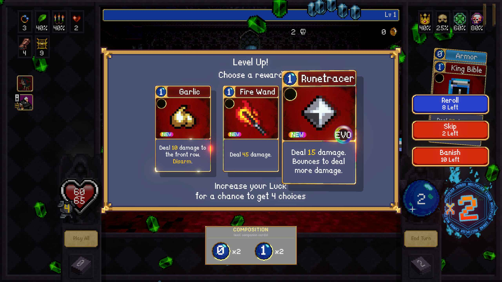
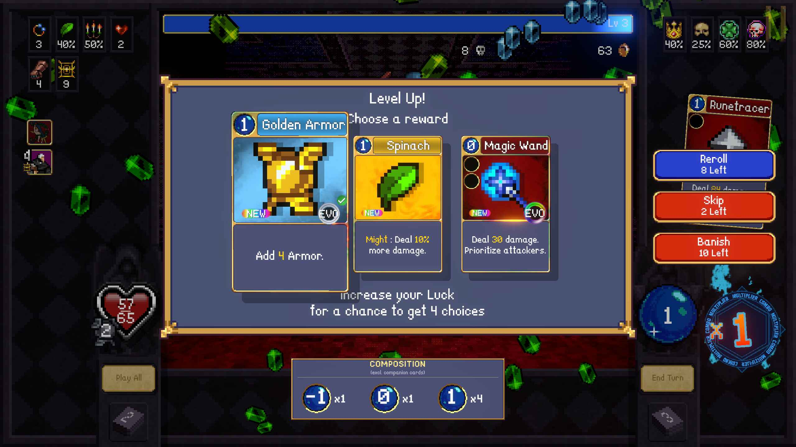
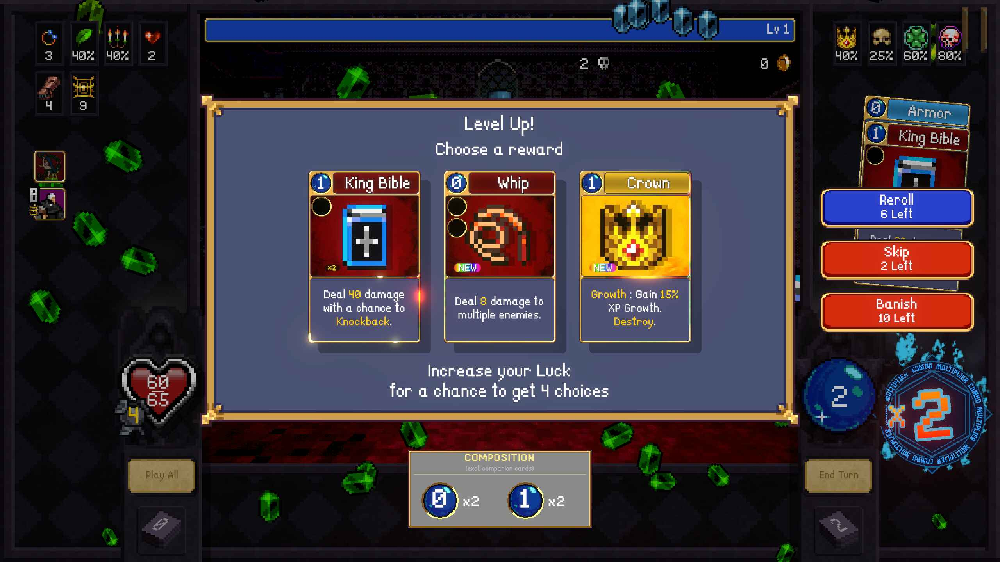
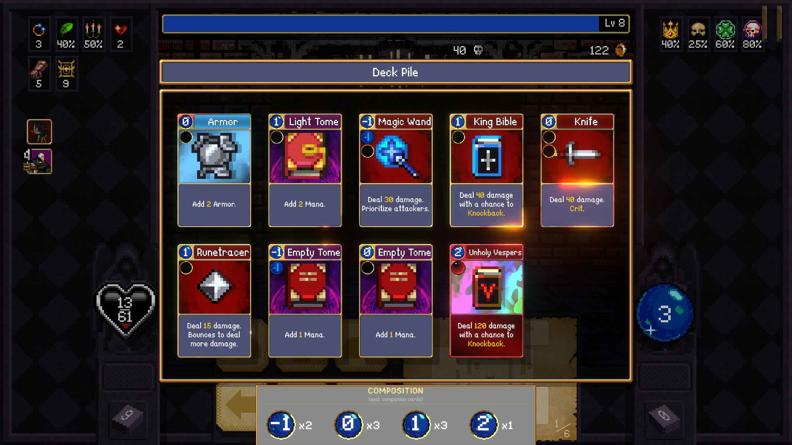
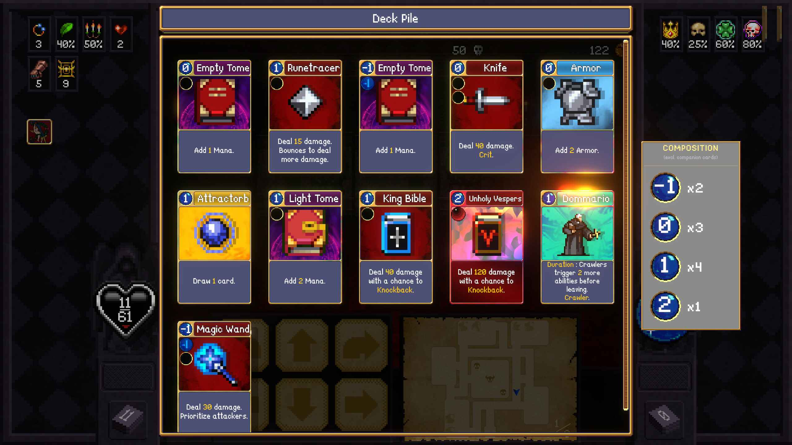
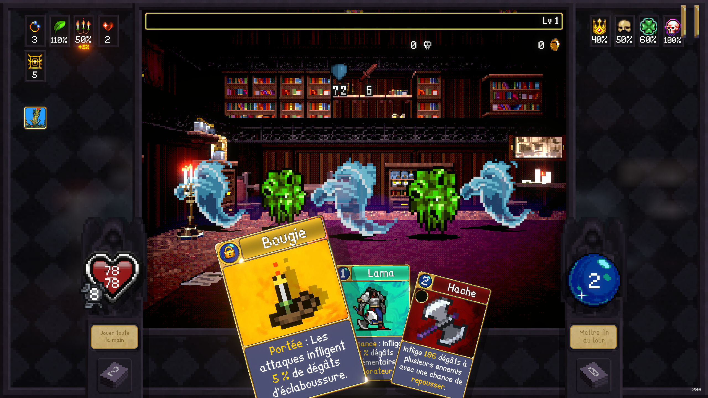

# BetterCards — Vampire Crawlers mod

A BepInEx mod for **Vampire Crawlers** that enhances the card UI with useful information at a glance.

---

## Features

### ✨ Level-up card selection — badges

- **EVO** (animated chromatic medallion, top-right) — appears on a card when picking it would complete an evolution combo your deck doesn't yet have. The rainbow ring rotates and a light streak sweeps across it for a holographic foil effect.
- **EVO bis** (smaller silver medallion with a green ✓, top-right) — appears when the offered card *would* complete a combo, but the combo is **already covered** by your current deck. Picking is redundant for that combo (still useful info if you want a duplicate, evolved tier, etc.).
- **NEW** (rainbow pill, top-left) — appears when you own zero copies of that card
- **×N** (gold pill, top-left) — shows how many copies of that card you already own

No more guessing whether a card completes a combo or whether you've seen it before.

### 📊 Deck viewer — COMPOSITION panel

When you open the **draw pile or discard pile** modal during combat, a **COMPOSITION** panel appears showing the mana cost distribution of your full deck (draw pile + hand + discard pile combined).

Each mana cost is shown as a colored orb with a count badge. The panel adapts to your deck size:

- **Small deck (≤10 cards visible)** — panel appears horizontally below the card list
- **Large deck (11+ cards)** — panel moves to the right side of the modal as a vertical list

Companion cards are excluded from the count.

### 🔒 Card Lock

Right-click any card (in combat hand, draw pile, or discard pile) to **lock** it. A golden padlock replaces the mana cost orb, and the game treats the card as unaffordable: clicking, dragging, pressing space/enter, or any other play attempt produces the natural "can't afford" shake + sound feedback instead of playing the card.

- 🎯 **Why it exists** — for cards with `Destruction` (one-shot consumed on play): you typically want to keep them in hand until you're ready (combo, fusion altar, etc.). Locking prevents accidental plays while you cycle through your other cards.
- 🖱️ **How to lock** — right-click the card, **or** press `.` / Suppr on the numeric keypad while hovering it.
- ⏭️ **Auto-skip** — when every card in hand is locked or unaffordable, the turn auto-ends if you have the game's "End turn automatically" option enabled.
- 💾 **Persistence** — locks survive game restarts (stored per-card via stable GUID in `BepInEx/config/BetterCards.locks.txt`).
- 📚 **Modal** — the same padlock appears on locked cards in the draw pile / discard pile modal. Right-click in the modal toggles the lock for that specific card. Two copies of the same card are tracked independently.

The whole feature can be disabled in `BepInEx/config/com.tovak.vc.bettercards.cfg` if you ever want to.

---

## Screenshots

### EVO and NEW badges



### EVO bis badge (combo already covered by deck)



### ×N badge (owned card count)



### COMPOSITION panel — horizontal (small deck)



### COMPOSITION panel — vertical (large deck)



### Card Lock — locked card in combat hand



---

## Requirements

- [BepInEx 6.0.0-be.755 (IL2CPP)](https://github.com/BepInEx/BepInEx/releases) or later

---

## Installation

1. Install BepInEx in your Vampire Crawlers folder if not already done
2. Download `BetterCards.dll` from the [Releases](../../releases) page
3. Drop it into `Vampire Crawlers/BepInEx/plugins/`
4. Launch the game

---

## Building from source

> The `.csproj` references DLLs from a local Vampire Crawlers installation.
> Update the `HintPath` entries in `VCComboIndicator.csproj` to match your own install path before building.

```
dotnet build -c Release
```

---

## Author

**TovaK**

If you enjoy the mod, you can support me on Ko-fi:  
[](https://ko-fi.com/tovak66)

---

## License

Free to use and redistribute. Credit appreciated.
